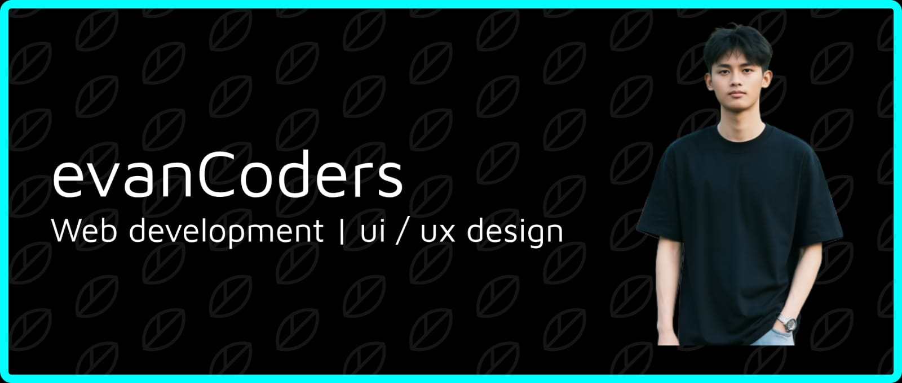

## Hallo, I'm Evan Purnamalila Kosasih 

- **Developer pemula** yang antusias dalam **Code Craft**  
- Sedang belajar membangun **branding** untuk audiens  
- Siap membangun kode untuk Anda

---

### GitHub Stats

---

### Tech Stack (Badges)

---

### Tech Stack (Skill Icons)

**Catatan Level Kemampuan:**

- PHP, Python, Laravel, Google Sign In -> Basic (masih belajar intensif)
- MySQL, MariaDB, HTML, CSS, Git -> Nyaman digunakan
- GitHub, GitLab, Canva -> Operasional dasar

Target: semua skill minimal level Nyaman ke depan

---

### Socials

---

### Contribution Graph

<picture>
  <source media="(prefers-color-scheme: dark)" srcset="https://raw.githubusercontent.com/evanCoders/evanCoders/pacman-output/pacman-contribution-graph-dark.svg">
  <source media="(prefers-color-scheme: light)" srcset="https://raw.githubusercontent.com/evanCoders/evanCoders/pacman-output/pacman-contribution-graph.svg">
  
</picture>
---

### Snake Animation

---

